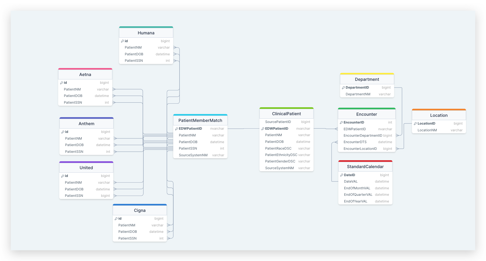

# SQL Proficiency 🚀

Welcome to the Super Modern SQL Proficiency Guide! Whether you're a seasoned SQL ninja or just starting your journey, this document will help you level up your SQL game. Let's dive in! 💻

## Table of Contents 📑

1. [Introduction](##introduction)
2. [Basic Queries](##basic-queries)
3. [Advanced Queries](##advanced-queries)
4. [Data Manipulation](##data-manipulation)
5. [Joins & Unions](##joins-and-unions)
6. [Aggregation](##aggregation)
7. [Window Functions](##window-functions)
8. [Indexes and Optimization](##indexes-and-optimization)
9. [Transactions](##transactions)
10. [Stored Procedures](##stored-procedures)
11. [Data Modeling](##data-modeling)
12. [Bonus Tips](##bonus-tips)
13. [Resources](resources)

## Introduction 🌐

SQL (Structured Query Language) is the language of databases. Whether you're fetching data or transforming it, SQL is your go-to tool. Let's explore its depths!

## Basic Queries 🕵️‍♂️

### Selecting Columns

```sql
SELECT column1, column2
FROM table
WHERE condition;
```

### Filtering Results

```sql
SELECT *
FROM table
WHERE column = 'value';
```
## Advanced Queries 🚀

### Subqueries

```sql
SELECT *
FROM table
WHERE column IN (SELECT column FROM another_table);
```

### Common Table Expressions

```sql
WITH cte_name AS (
  SELECT column
  FROM table
)
SELECT *
FROM cte_name;
```


## Data Manipulation ✨

### Inserting Data
```sql
INSERT INTO table (column1, column2)
VALUES ('value1', 'value2');
```

### Updating Data
```sql
UPDATE table
SET column = 'new_value'
WHERE condition;
```

## Joins and Unions 🔗

### Inner join
```sql
SELECT *
FROM table1
JOIN table2 ON table1.column = table2.column;
```
### Union
```sql
SELECT column FROM table1
UNION
SELECT column FROM table2;
```

## Aggregation 📊
### Group By
```sql
SELECT column, COUNT(*)
FROM table
GROUP BY column;

```
### Having clause
```sql
SELECT column, COUNT(*)
FROM table
GROUP BY column
HAVING COUNT(*) > 1;
```

## Window Functions 🪟

### Rank and Partition (could also be Row_Number)
```sql
SELECT column, RANK() OVER (PARTITION BY category ORDER BY value DESC) AS ranking
FROM table;
```

## Indexes and Optimization ⚙️

### Indexing
```sql
CREATE INDEX index_name
ON table (column);
```

### Query Optimization
```sql
EXPLAIN SELECT column
FROM table
WHERE condition;
```

## Transactions 🔄

```sql
BEGIN TRANSACTION;

-- SQL Statements here

COMMIT;

```

## Stored Procedures 📦

```sql
CREATE PROCEDURE procedure_name
AS
BEGIN
  -- SQL Statements here
END;

```

### Data Modeling 🛠️



### Bonus Tips
1. Use aliases for readability: SELECT column AS alias_name.
2. Learn to love and hate indexes—they can make or break performance.
3. Embrace the power of window functions for complex analyses.


